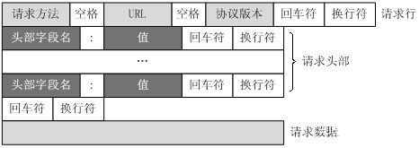
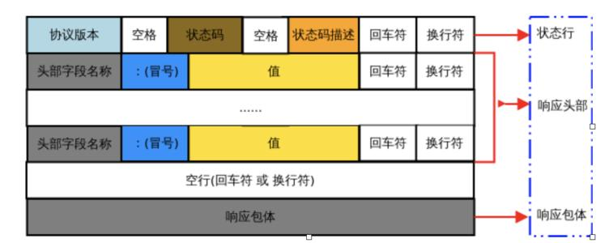

#### http请求由什么组成？

    
展开

    <ul>
        <li>
            请求行
            <ul>
                <li>请求方法字段</li>
                <li>URL字段</li>
                <li>HTTP协议版本字段</li>
            </ul>
        </li>
        <li>
            请求头部（key-value形式）
            <ul>
                <li>User-Agent：产生请求的浏览器类型</li>
                <li>Accept：客户端可识别的内容类型列表</li>
                <li>Host：请求的主机名</li>
                <li>……</li>
            </ul>
        </li>
        <li>空行：即 回车符\r + 换行符\n ，通知服务器以下不再有请求头部</li>
        <li>请求数据（POST方法中，会把数据以key-value的形式发送请求）</li>
        
    </ul>

#### http响应报文的组成？

    
展开

    <ul>
        <li>
            状态行
            <ul>
                <li>HTTP协议版本</li>
                <li>状态码</li>
                <li>状态码描述</li>
            </ul>
        </li>
        <li>
            消息报头
            <ul>
                <li>Date：日期</li>
                <li>Content-Type：内容类型</li>
                <li>Content-Length：内容长度</li>
                <li>……</li>
            </ul>
        </li>
        <li>空行：即 回车符\r + 换行符\n</li>
        <li>响应正文：如果是纯数据就是返回纯数据，如果请求的是HTML页面，那么返回的就是HTML代码，如果是JS就是JS代码</li>
        
    </ul>

#### http有哪些请求方法？

    
展开

    

        HTTP1.0 定义了三种请求方法：GET、POST、HEAD
    

	

		HTTP1.1 新增了六种请求方法：OPTIONS、PUT、PATCH、DELETE、TRACE、CONNECT
    

    <ol>
        <li>GET：请求指定的页面信息</li>
        <li>POST：向指定资源提交数据进行处理请求（例如提交表单或者上传文件），数据在请求体中</li>
        <li>HEAD：类似于 GET 请求，只不过返回的响应中没有具体的内容，用于获取消息报头</li>
        <li>PUT：从客户端向服务器传送数据取代指定文档的内容</li>
        <li>DELETE：请求服务器删除指定的页面</li>
        <li>OPTIONS：返回服务器针对特定资源所支持的HTTP请求方法，也可用来测试服务器性能</li>
        <li>PATCH：是对PUT的补充，用来对已知资源进行局部更新</li>
        <li>TRACE：回显服务器收到的请求，主要用于测试或诊断</li>
        <li>CONNECT：预留给能够将连接改为管道方式的代理服务器</li>
    </ol>

#### GET和POST的区别？

    
展开

    <ol>
        <li>GET一般用于从服务器获取资源，而POST则有可能改变服务器上的资源</li>
        <li>GET请求的数据通过URL传递，在请求头中，有长度限制；POST请求的数据在请求体中，无长度限制</li>
        <li>GET请求会被浏览器主动缓存，且其请求数据明文出现在URL中，而POST不会，除非手动设置，POST的安全性更高</li>
        <li>GET请求中如果有非ASCII字符，会在请求之前进行转码，而POST不用</li>
    </ol>

#### PUT和POST的区别？

    
展开

    <ul>
        <li>PUT请求：如果两个请求相同，后一个请求会把前一个请求覆盖掉，所以PUT一般用来改资源</li>
        <li>POST请求：后一个请求不会把前一个请求覆盖掉，所以POST一般用来增资源</li>
    </ul>

#### http有哪些常见状态码？

    
展开

    <ol>
        <li>
            2xx：成功处理请求
            <ul>
                <li>200 请求成功 OK</li>
            </ul>
        </li>
        <li>
            3xx：重定向
            <ul>
                <li>301 永久移动</li>
                <li>302 临时移动</li>
                <li>304 未修改</li>
            </ul>
        </li>
        <li>
            4xx：客户端错误
        	<ul>
                <li>400 语法错误 Bad Request</li>
                <li>401 未授权 Unauthorized</li>
                <li>403 禁止 Forbidden</li>
                <li>404 未找到 Not Found</li>
            </ul>
        </li>
        <li>
            5xx：服务器错误
        	<ul>
                <li>500 服务器内部错误</li>
                <li>501 不支持请求的功能</li>
            </ul>
        </li>
    </ol>

#### 301，302，304的区别

    
展开

    <ul>
        <li>301表示永久重定向，表示请求的资源分配了新的URL，以后应使用新URL</li>
        <li>302表示临时重定向，请求的资源临时分配了新的URL，本次请求暂且使用新URL</li>
        <li>304表示所请求的资源未修改，服务器返回此状态码时不会返回任何资源（客户端通常会缓存访问过的资源，通过提供一个头信息指出客户端希望只返回在指定日期之后修改的资源，若发现数据没有更新，则直接从缓存中读取数据）</li>
    </ul>

